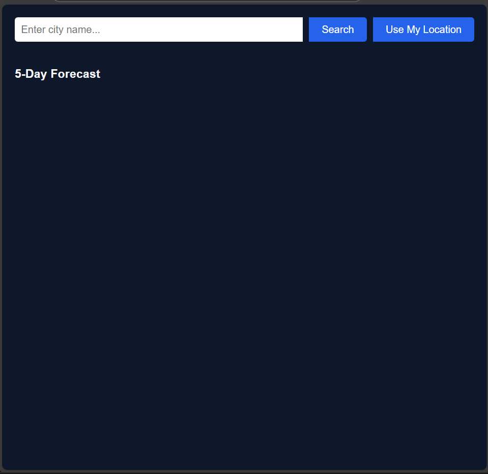
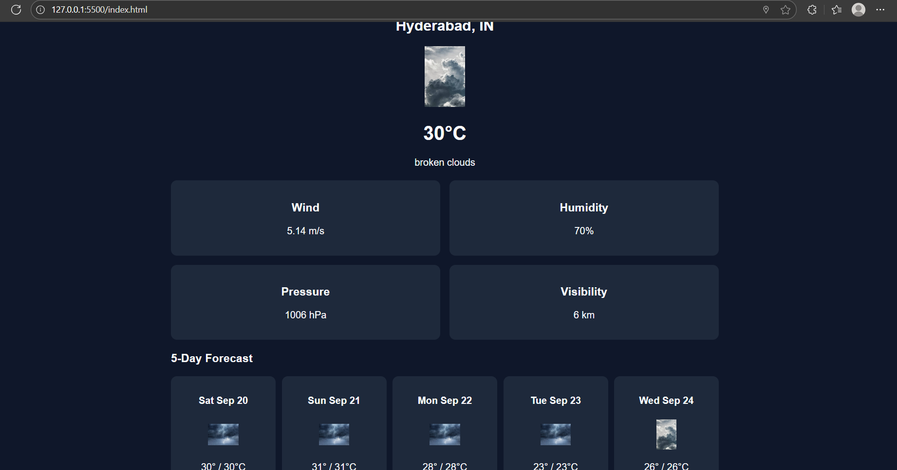

# Weather Dashboard 🌤️

A **Weather Dashboard** built using **HTML, CSS, and JavaScript**, leveraging the **OpenWeatherMap API** to provide real-time weather information for any city and the user’s current location. This project demonstrates web development, API integration, and responsive UI design — perfect for showcasing skills for an internship.

## 🚀 Features

- Search weather by **city name**  
- Get **current weather** using your **location (geolocation API)**  
- Display **temperature, weather description, wind speed, humidity, pressure, and visibility**  
- **5-day weather forecast** with min/max temperatures  
- Custom **weather icons** for sunny, rainy, cloudy, and snowy conditions  
- Clean, modern, and **responsive UI**  

## 🛠️ Tech Stack

- **Frontend:** HTML, CSS, JavaScript  
- **API:** [OpenWeatherMap API](https://openweathermap.org/api)  
- **Version Control:** Git & GitHub  
- **Hosting:** GitHub Pages  

## 📂 Project Structure

```text
project_folder/
│
├─ index.html         ← Main HTML file
├─ README.md          ← Project documentation
├─ weather/           ← Folder containing custom weather icons
│   ├─ sun.jpeg
│   ├─ snow.jpeg
│   ├─ rain.jpeg
│   └─ cloud1.jpeg
└─ screenshots/       ← Folder for dashboard screenshots (optional)
```
## 💻 How to Run Locally

1. **Clone the repository:**


git clone https://github.com/vanivarun/weather-dashboard.git

2. **Navigate to the project folder:**


cd weather-dashboard


3. **Open `index.html`** in your browser or run a **local server** (optional):


# Using VS Code Live Server extension


4. Enter a city name or click **Use My Location** to see current weather and 5-day forecast.


## 🌐 Live Demo

You can host the project online using **GitHub Pages**:


https://vanivarun.github.io/weather-dashboard/


*(Replace with actual live link after enabling GitHub Pages in repo settings)*

## 🖼️ Screenshots





## 🔮 Future Improvements

* Add **sunrise and sunset times**
* Display **chance of rain and weather alerts**
* Add **dynamic background animations** for sun, clouds, and rain
* Improve **mobile responsiveness and UI/UX**
* Integrate **additional weather APIs** for richer data


## 📄 License

This project is **open-source** and free to use for personal or educational purposes.


**Prepared by:** V Varun


